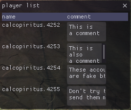

# GW2 Player List

A plugin for [ArcDPS](http://www.deltaconnected.com/arcdps/)

Save other players' account names and add comments to them, instead of blocking/adding to friends and setting an alias.

## Installation

1. Install [ArcDPS](http://www.deltaconnected.com/arcdps/)
2. Install the [unofficial extras addon](https://github.com/Krappa322/arcdps_unofficial_extras_releases/releases/latest)
3. Download player_list.dll from [releases](https://github.com/Calcoph/gw2-player-list/releases/latest)
4. Place player_list.dll in \<Path to "Guild Wars 2">\addons\arcdps

## Uninstalling

1. delete \<Path to "Guild Wars 2">\addons\arcdps\player_list.dll
2. delete \<Path to "Guild Wars 2">\addons\arcdps\player_list.toml
3. delete \<Path to "Guild Wars 2">\addons\arcdps\player_list.tmp (if it exists)

## Compilation

1. Download [rust](https://www.rust-lang.org/tools/install)
2. run `cargo build --release`

The .dll should be in target/release/player_list.dll

No other files are needed, just player_list.dll

## Usage

Players in your current squad will appear in the list. Just write something in the comment box to save it. Players with an empty comment box will be erased from the list, so to delete someone just empty their comment box.
